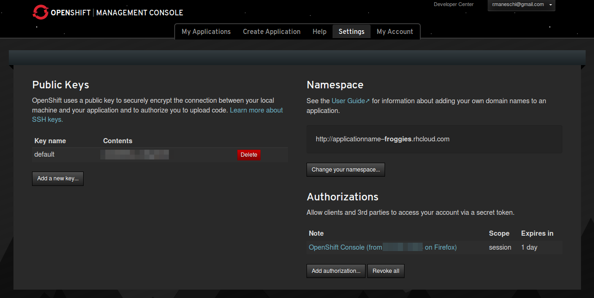
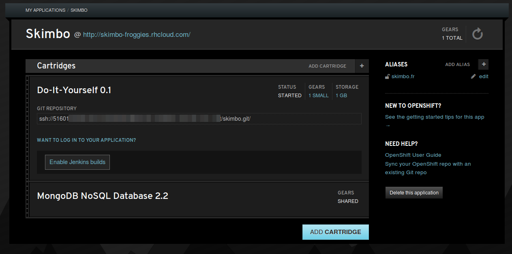
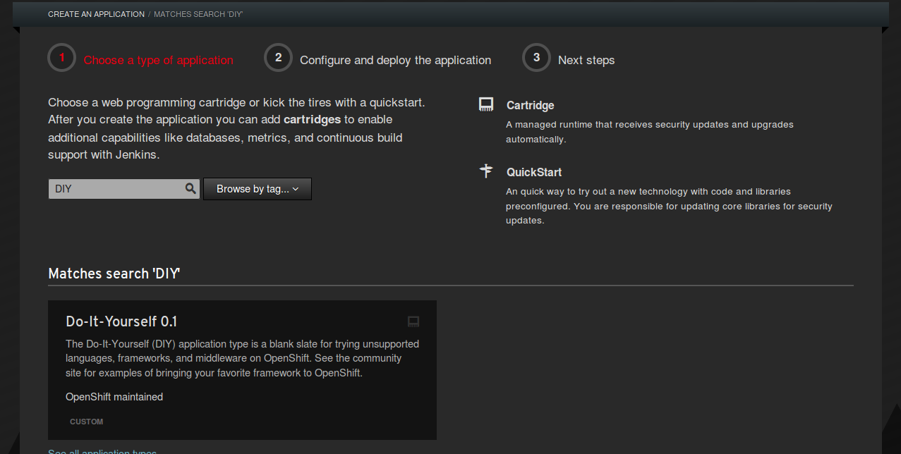
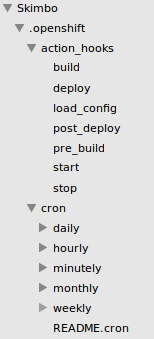

#Déployer un projet scala/playframework sur openshift

Vous connaissiez <a href="http://aws.amazon.com/" target="_blank">AWS</a>, <a href="https://www.heroku.com/" target="_blank">Heroku</a> ou <a href="https://www.dotcloud.com/" target="_blank">dotCloud</a>. Voici arriver un nouvel acteur d'importance sur ce marché tant convoité du Paas. Et ce nouvel acteur n'est ni plus ni moins que <a href="https://www.redhat.com/">RedHat</a>.

###Commercial mode !

Ce que nous propose RedHat par le biai de son outil <a href="https://www.openshift.com">OpenShift</a> est tout simplement magique. Non seulement il est à la hauteur de ses concurrents existants, mais en plus il est open-source. Vous l'aurez compris son leitmotiv, est : "venez tester votre solution chez nous, puis si elle marche, payez pour scaler, ou achetez un serveur et installez OpenStack". Sympa de ne plus être tributaire d'un service, non ? OpenStack étant la pile logicielle sur laquelle est basée OpenShift.

Son système repose sur des gears, on peut les assimiler à une instance virtuelle d'un serveur. Là où heroku ne propose gratuitement qu'un web-dyno, OpenShift nous en propose 3. Soit en théorie, 1,5 Go de RAM. Comment font-ils ? Tout simplement en vous attribuant en réalité 1 seul gear, et lorsque votre application est à 100% de cpu ou de ram, il scale automatiquement à 2 puis 3. Lorsque votre application redescend, il enlève graduellement les gears. Ce qui permet de mieux répartir les ressources matérielles. Bien sûr c'est basé sur le fait que tout le monde, n'utilise pas tout le temps toute la ressource...

Son écosystème des services tiers n'est pas encore à la hauteur d'Heroku, mais l'open-source va faire accélérer de manière exponentielle ce nombre. Il contient cependant tout ce dont on a besoin de base. Une jvm prêt à l'emploi, du MongoDb ou encore mysql. Je vous laisse faire le tour de leurs <a href="https://www.openshift.com/developers/technologies">Cartridges</a> pour en savoir plus.

Ce que j'ai particulièrement aimé chez eux, c'est qu'ils vous donne l'accès ssh à la vm. Certes un cli existe pour vous faciliter déploiement et maintenance, mais qu'est-ce que c'est sympa de pouvoir faire un "top" pour comprendre ce qui se passe sur le serveur :D

Après cette rapide intro passons aux choses sérieuses : le déploiement sur OpenShift !

###Sur OpenShift

Après avoir créé un compte chez eux, vous pouvez uploader votre clé ssh publique à partir de leur site. Ensuite il suffit de créer une application pour récupérer l'adresse url de connexion par ssh. Malheureusement, il n'existe pas (encore) de config pour scala/playframework. Qu'à cela ne tienne, nous allons utiliser un serveur "nu" et tout faire nous même. C'est là que l'open-source et le fait d'avoir le contrôle sur le serveur, prennent tout leur sens.

OpenShift, tout comme heroku, va créer un repo git pour votre synchro. Il vous faut donc soit le merger dans votre projet actuel, soit démarrer votre projet dans ce répertoire.

Dans ce dossier, se trouve un répertoire .openshift dans lequel vous retrouvez deux nouveaux répertoires : .action_hooks et .cron. Le premier permet d'automatiser des tâches lors du déploiement, le second de créer des crons.

###Au boulot

Après plusieurs nuits de tests, j'ai abandonné l'idée de vouloir pousser les sources sur le serveur afin qu'il compile et fasse tout tout seul (comme Heroku). A la place je compile sur mon pc et je pousse la version staggée de mon projet sur leur serveur.

Pour cela rien de plus simple, un petit <a href="https://raw.github.com/Froggies/Skimbo/master/script/deploy_openshift.sh">script shell</a>, largement inspiré par <a href="http://greweb.me/2013/05/playframework-simple-deployment-scripts/">celui-ci</a>.

En deux mots, il compile la version actuelle du projet grâce à la fonction stage de playframework. Il arrête le serveur playframework et il rsync (upload le différentiel) le résultat du pc, vers le serveur distant. Enfin, il relance le serveur playframework distant.

Comme vous pourrez le remarquer, j'utilise les fichiers scripts <a href="https://github.com/Froggies/Skimbo/blob/master/.openshift/action_hooks/start">start</a> et <a href="https://github.com/Froggies/Skimbo/blob/master/.openshift/action_hooks/stop">stop</a> du répertoire .openshift/action_hooks. C'est pour garder le fonctionnement standard d'Openshift, si un jour un cartbridge playframeworks sort, ou si le serveur est mis à jour ce seront ces scripts qui seront appelés.

La procédure dure une dizaine de minutes pour une interruption de service n'excédant pas les 5 minutes. Certes interruption de service il y a, mais elle est raisonnable. Je pense également qu'on peut imaginer de déplacer l'arrêt du serveur après le rsync mais cela dépend de votre projet et de votre déploiement.

Une faute d'orthographe, une grosse bétise, une photo mal placée ? Faites une pull-request ;)
